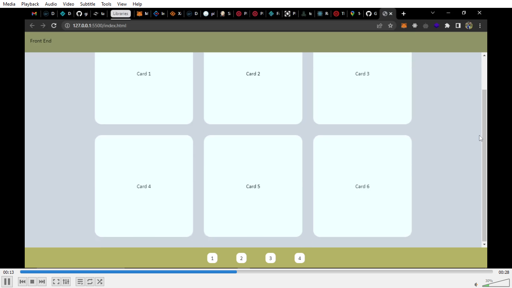

## Front End Challenge

- [ ] **Simple Challenge**
      **_Use the template provided_**

## <a href="./guide.mp4" title="Challenge video guide"></a>

- Create a responsive single page site which has a fixed header, a scrolling main content and fixed footer.

- main content should have six card displayed flex and when hover it should should have a different background color with scale transformation.

- the footer should 4 box represented as bottom icons and should responsive as seen in the provided video

### Javascript

- When each card is clicked, alert the text content of the card.

---

- [ ] Should be submitted in within 24hours.

[From Condueet Team](https://condueet.netlify.app)

```javascript
const creator = "Timi James";
```
